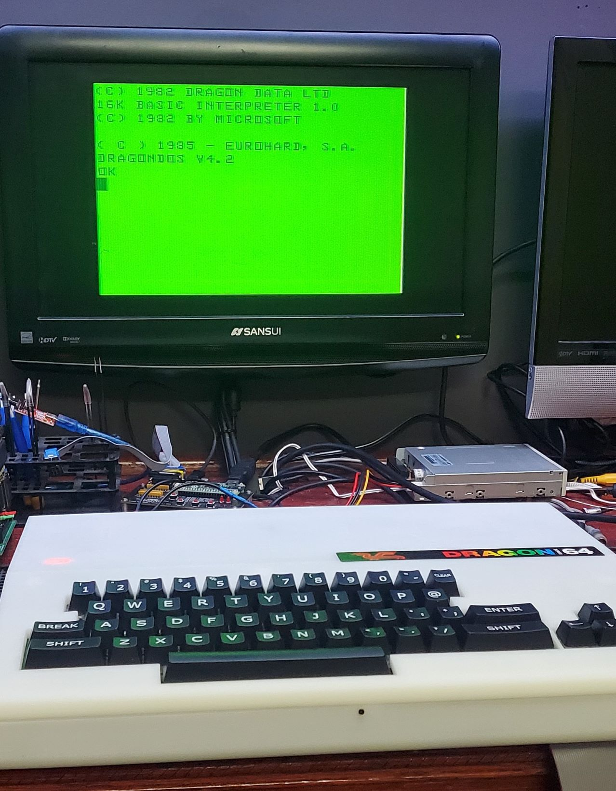
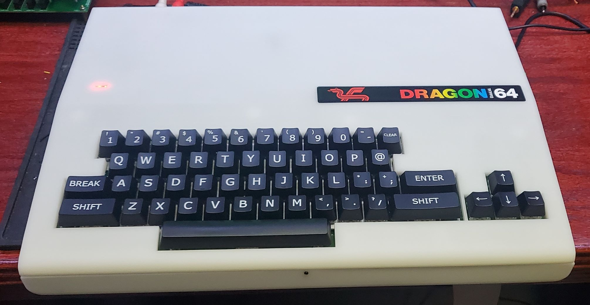
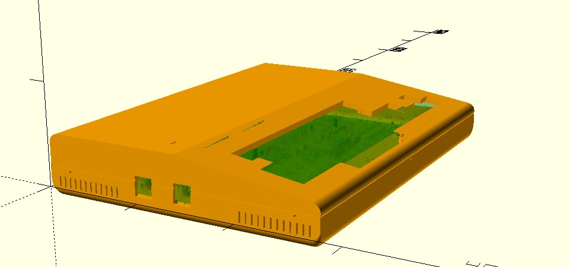
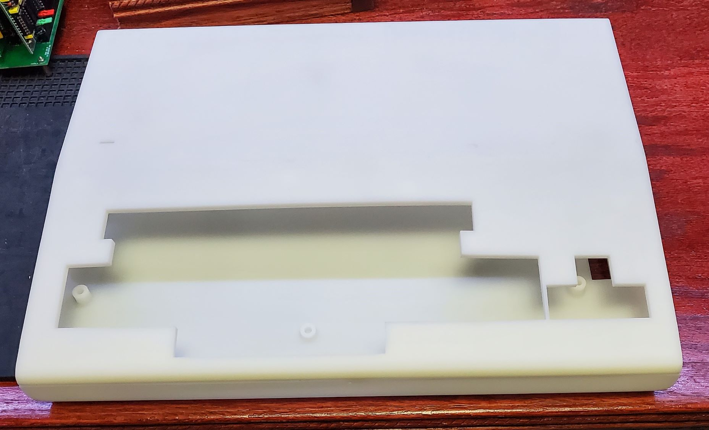
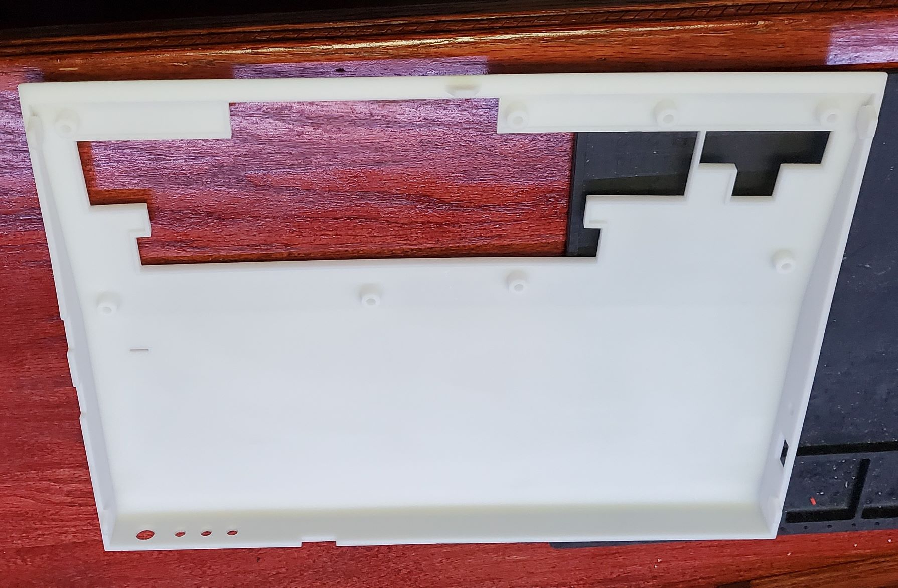
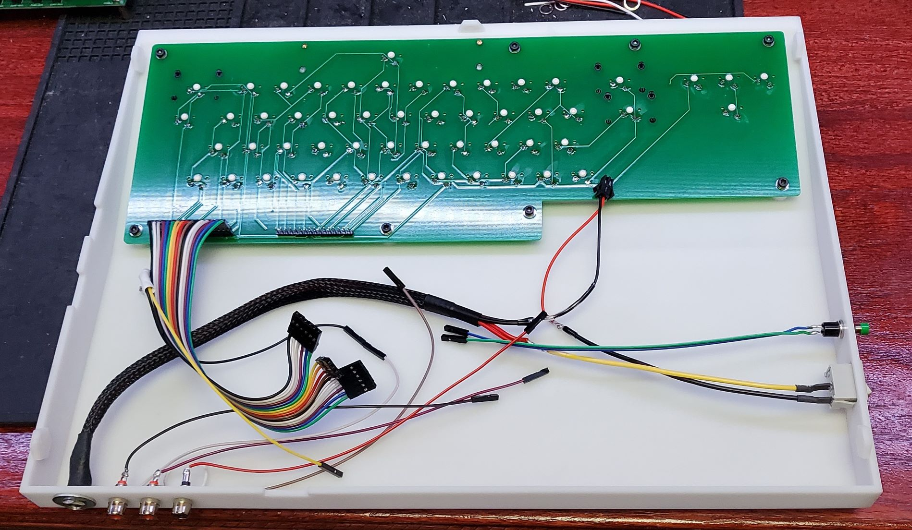
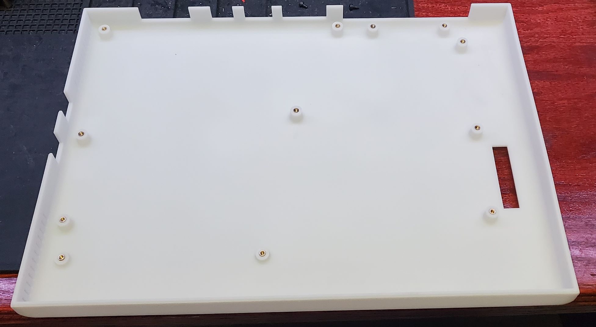
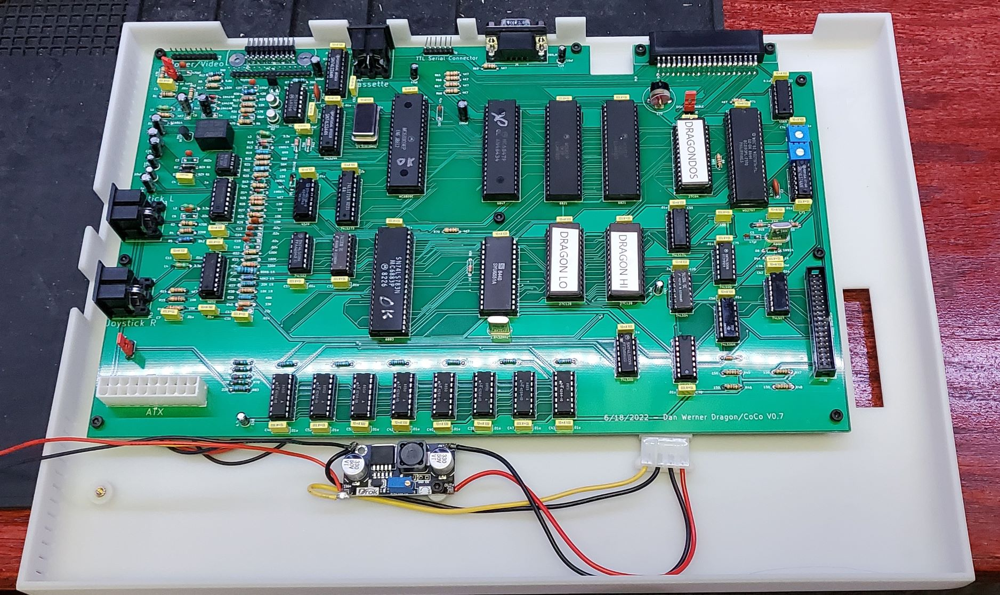

(note that I need to get a better picture of the screen, this is s-video and is very clear in person)

# Dragon 64 Clone PCB

The Dragon 64 is a home computer that was built in the 1980s for the European market by Dragon Data, Ltd. The Dragons are very similar to the TRS-80 Color Computer, and in fact provisions have been made to allow the keyboard to become compatible with a TRS-80 color computer clone.   This version of the Dragon 64 computer produces NTSC rather than PAL composite video and has the ability to produce "Commodore style LCA" s-video output for a much clearer video display.  It also supports either a vertical or horizontal cartridge slot and TTL level serial capabilities for convenient use of modern TTL to USB adaptors.

It should be possible for this PCB to become a Tandy Color Computer clone as well, but this is not implimented in V1.

A regulated 12V and 5V power supply is required.

The main PCB also includes a DragonDOS floppy controller that can be optionally populated to support floppy disk support.

A design is included for a 3d-printed retro style case.

Note that much of this work is based on the work done by Ciaran Anscomb.  Without that original work, this would have taken much longer to complete.

More generalized information on this line of retro computers can be found here:

   * https://en.wikipedia.org/wiki/Dragon_32/64
   * https://colorcomputerarchive.com/
   * https://cococentral.com/
   * https://www.6809.org.uk/dragon/
   * http://dragondata.co.uk/

---

## To Do:
* test the joystick interface
* test the cassette interface
* test the printer interface
---

## What is included in this repo?
As of this time, the repo includes

1. The Mainboard PCB Kicad design and Gerber files
2. The Keyboard PCB Kicad design and Gerber files
3. OpenSCAD and STL files for a 3d printed case
4. SVG file for custom keycaps from MAX Keyboard

---

## Known Bugs

### System Jumpers
LK1 - Ram Size Selection 64K=1&2, 32K=2&3

J3 - Composite on Luma J3 on for composite video, off for S-video

J5 - Enable Disk ROM

---

## Bill Of Materials

### Mainboard
QTY|ref|value|part|description
--------|--------|----|--------|--------
1|IC4|4050|4050|
1|IC7|4069|4069|Hex inverter
8|IC15, IC16, IC21, IC22, IC26, IC27, IC32, IC33|4164|4164|
1|IC6|4529|4529|
1|IC11|6551|6551|
2|IC5,IC8|6821|6821|Peripheral Interface Adapter 1MHz| DIP-40
1|IC10|6847|6847|
1|IC39|6883|6883|
1|D8|1N914|1N914|100V 0.3A Small Signal Fast Switching Diode| DO-35
2|IC34,IC37|27C128|27C128|OTP EPROM 128 KiBit| [Obsolete 2004-01]
1|U5|27C64|27C64|OTP EPROM 64 KiBit| [Obsolete 2004-01]
2|IC35,U3|74LS00|74LS00|quad 2-input NAND gate
1|IC36|74LS02|74LS02|quad 2-input NOR gate
1|U6|74LS04|74LS04|Hex Inverter
1|U8|74LS06N|74LS06N|Inverter Open Collect
1|U4|74LS07|74LS07|Hex Buffers and Drivers With Open Collector High Voltage Outputs
1|IC40|74LS138|74LS138|Decoder 3 to 8 active low outputs
1|U7|74LS139|74LS139|Dual Decoder 1 of 4| Active low outputs
1|U9|74LS174|74LS174|Hex D-type Flip-Flop| reset
2|IC1|,C25|74LS244|74LS244|Octal Buffer and Line Driver With 3-State Output| active-low enables| non-inverting outputs
1|IC20|74LS273|74LS273|8-bit D Flip-Flop| reset
1|J1|Screw Terminal|5mm pitch|Power supply
1|C3|.002u|C|Unpolarized capacitor
37|C1, C7, C11, C12, C18, C20, C21, C22, C29, C31, C32, C34, C38, C39, C40, C41, C42, C43, C45, C46, C47, C50, C51, C52, C53, C55, C56, C57, C62, C65, C66, C70, C71, C72, C73, C74, C75, C76|.01u|C|Unpolarized capacitor
5|C6,C13,C14,C15,C16|.02u|C|Unpolarized capacitor
7|C27, C33, C4, C49, C59, C60, C61|.1u|C|Unpolarized capacitor
2|C33,C49|0.1uf|C|Unpolarized capacitor
1|C2|0.22uf|C|Unpolarized capacitor
1|C37|100pf|C|Unpolarized capacitor
1|C78|10nf|C|Unpolarized capacitor
2|C8,C48|1u|C|Unpolarized capacitor
1|C17|22p|C|Unpolarized capacitor
1|C35|25uf|C|Unpolarized capacitor
1|C44|470pf|C|Unpolarized capacitor
1|C67|47p|C|Unpolarized capacitor
1|C30|56pf|C|Unpolarized capacitor
1|C10|10u|C_Polarized_Small_US|Polarized capacitor| small US symbol
4|C9,C24,C25,C54|1u|C_Polarized_Small_US|Polarized capacitor| small US symbol
1|C26|C63|100uf|C_Polarized_US|Polarized capacitor| US symbol
1|C19|10uf|C_Polarized_US|Polarized capacitor| US symbol
1|C23|10uf 16v|C_Polarized_US|Polarized capacitor| US symbol
2|C58,C64|4.7uf|C_Polarized_US|Polarized capacitor| US symbol
1|C36|47uf|C_Polarized_US|Polarized capacitor| US symbol
2|C11,C7|.01u|C_Small|Unpolarized capacitor| small symbol
1|C77|8-70pf|C_Trim|Trimmable capacitor
1|J3|composite on luma|Conn_01x02_Male|Generic connector| single row| 01x02| script generated (kicad-library-utils/schlib/autogen/connector/)
1|J5|DISK ROM ENABLE|Conn_01x02_Male|Generic connector| single row| 01x02| script generated (kicad-library-utils/schlib/autogen/connector/)
1|J2|TTL Serial Connector|Conn_01x06_Male|Generic connector| single row| 01x06| script generated (kicad-library-utils/schlib/autogen/connector/)
1|PL6|Power/Video|Conn_01x09|Generic connector| single row| 01x09| script generated (kicad-library-utils/schlib/autogen/connector/)
1|PL1|Keyboard|Conn_01x16|Generic connector| single row| 01x16| script generated (kicad-library-utils/schlib/autogen/connector/)
1|PL2|Printer|Conn_02x10_Odd_Even|Generic connector| double row| 02x10| odd/even pin numbering scheme (row 1 odd numbers| row 2 even numbers)| script generated (kicad-library-utils/schlib/autogen/connector/)
1|J6|Floppy Interface|Conn_02x17_Odd_Even|Generic connector| double row| 02x17| odd/even pin numbering scheme (row 1 odd numbers| row 2 even numbers)| script generated (kicad-library-utils/schlib/autogen/connector/)
1|PL7|Cartridge|Conn_02x20_Odd_Even|Generic connector| double row| 02x20| odd/even pin numbering scheme (row 1 odd numbers| row 2 even numbers)| script generated (kicad-library-utils/schlib/autogen/connector/)
1|Y2|1.8432Mhz|Crystal|Two pin crystal
1|X1|14.31818Mhz|CXO_DIP14|Crystal Clock Oscillator| DIP14-style metal package
1|D4|1N4002|D|Diode
4|D5,D6,D7,D11|1N4148|D|Diode
4|D1,D12,D13,D14|1N914|D|Diode
2|D2,D3|BZX 61|D_Zener_Small|Zener diode| small symbol
1|J4|DB9_Male|DB9_Male|9-pin male D-SUB connector
1|PL4|Cassette|DIN-5_180degree|5-pin DIN connector (5-pin DIN-5 stereo)
2|PL3,PL5|Joystick L|DIN-6|6-pin DIN connector
1|LK1|Jumper_3_Bridged12| pins 1+2 closed/bridged
4|L1,L2,L3,L4|3.3u|L|Inductor
1|IC2|LM393|LM393|Low-Power| Low-Offset Voltage| Dual Comparators| DIP-8/SOIC-8/TO-99-8
1|U1|MAX232|MAX232|Dual RS232 driver/receiver| 5V supply| 120kb/s| 0C-70C
1|U2|MC1372|MC1372|
1|IC38|MC6809E|MC6809E|
2|Q2,Q3|2N2222|Q_NPN_BCE|NPN transistor| base/collector/emitter
1|TR1|BC182L|Q_NPN_BCE|NPN transistor| base/collector/emitter
1|Q1|BC557|Q_PNP_BCE|PNP transistor| base/collector/emitter
4|R45,R46,R47,R48|150|R|Resistor
2|R7,R12|390|R|Resistor
1|R30|420|R|Resistor
3|R6,R31,R85|470|R|Resistor
1|R43|750|R|Resistor
1|R13|820|R|Resistor
3|R17,R32,R42|100K|R|Resistor
1|R1|100R|R|Resistor
6|R9,R11,R15,R16,R26,R28|10K|R|Resistor
1|R29|10M|R|Resistor
1|R23|15K|R|Resistor
6|R10,R18,R27,R41,R44,R64|1K|R|Resistor
1|R22|1M5|R|Resistor
1|R4|220R|R|Resistor
11|R73,R74,R75,R76,R77 ,R78,R79,R80,R81,R82,R83|22R|R|Resistor
1|R40|33K|R|Resistor
1|R3|470R|R|Resistor
11|R14,R2,R24,R25,R65 ,R66,R67,R68,R69,R70,R71|4K7|R|Resistor
1|R8|5.6k|R|Resistor
2|R20,R21|56K|R|Resistor
1|R39|68K|R|Resistor
1|R19|6K8|R|Resistor
1|R5|8K2|R|Resistor
2|RV1,RV2|10K-Read|R_Potentiometer_Trim|Trim-potentiometer
1|R38|10K 1%|R_Small|Resistor| small symbol
1|R33|160K|R_Small|Resistor| small symbol
1|R37|20K 1%|R_Small|Resistor| small symbol
1|R34|330K|R_Small|Resistor| small symbol
1|R36|40K2 1%|R_Small|Resistor| small symbol
1|R35|80K6 1%|R_Small|Resistor| small symbol
1|RLA1|SPDT|TIANBO-HJR-4102-L|TIANBO HJR-4102-L| Single Pole Relay| 5mm Pitch| 3A
1|U10|WD2797|WD2797|Floppy disk controller| DIP-40
1|X2|1Mhz|XO91|HCMOS Clock Oscillator

### Keyboard
QTY|ref|value|part|description
--------|--------|----|--------|--------
53|SW(X)|KEYSWITCH|MX Cherry - Linear
3||Switch Leveling Kit|LEVELING KIT FOR LARGER KEYS|
1||Switch Leveling Kit|LEVELING KIT FOR SPACEBAR| EXAMPLE:	https://www.amazon.com/Plate-Mounted-Stabilizers-Balancing-Mechanical-Keyboard/dp/B07K8HP6KC/ref=sr_1_3?keywords=spacebar%2Bstabilizer&qid=1650655494&sprefix=SPACEBAR%2B%2Caps%2C77&sr=8-3&th=1
2|J1,J2|01X16 HEADER|Connector_PinHeader_2.54mm:PinHeader_1x16_P2.54mm_Vertical

### Floppy Drive Calibration (an oscilloscope is required)
1. power on, allow machine to reset and boot

2. ground Pin 22 of U10(WD2797)

3. Set VC0 by Measuring at pin 16 of the U10(WD2797),  Adjust the signal to 250 KHz (capacitor C77)

4. WP setting by Measuring signal at pin 31 of the U10(WD2797), Set pulse width to 300ns (RV2 potentiometer)

5. PR adjustment by Measuring signal at pin 29 of U10(WD2797), Set pulse width to 600ns (potentiometer RV1)

6. remove Pin 22 of the U10(WD2797) from ground

7. restart machine

### Case

### Questions?

If there are any questions, I can be reached at vic2020Dan at gmail dot com.

---